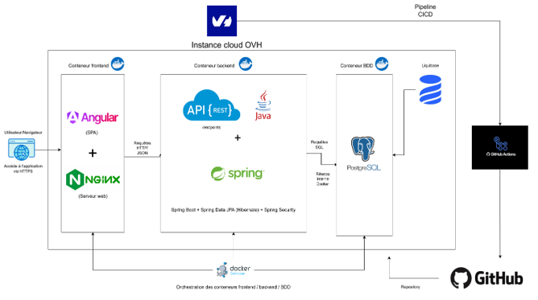
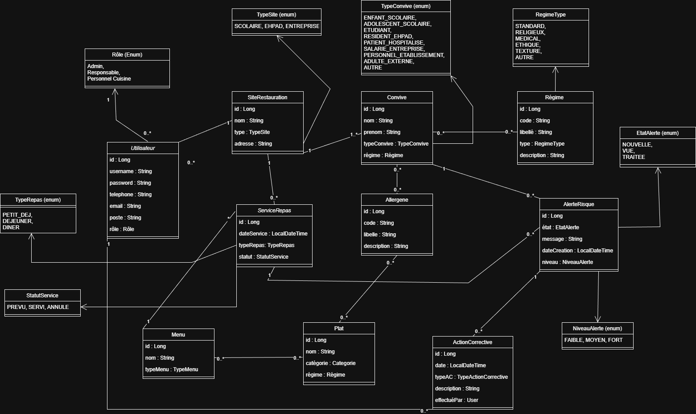

# RepasSur

[](https://github.com/BoubakriYoussef/repas_sur2/actions/workflows/ci.yml)

Application web full stack de restauration collective permettant de centraliser les profils convives, les allergies, les regimes alimentaires, les plats, les menus et les services afin de reduire le risque allergenique lors de la preparation et du service des repas.

## Cadre du projet

Ce depot contient le code source du projet realise dans le cadre de la certification RNCP niveau 7 "Expert en developpement logiciel".

L'objectif du projet est de demonstrer la conception et la mise en oeuvre d'une solution logicielle complete, securisee, testee et deployee autour d'un besoin metier concret :

- fiabiliser la gestion des informations sensibles liees aux allergies alimentaires ;
- outiller les equipes de restauration dans la planification des repas ;
- detecter en amont les situations a risque ;
- tracer les alertes et les actions correctives.

## Probleme metier traite

Dans un contexte de restauration collective, la multiplication des profils alimentaires, des allergies et des contraintes de service augmente le risque d'erreur humaine. RepasSur apporte une reponse outillee en structurant les donnees metier et en automatisant l'identification des incompatibilites entre convives, plats et menus.

## Fonctionnalites principales

- authentification securisee par JWT et gestion des roles ;
- gestion des convives et de leurs contraintes alimentaires ;
- gestion du referentiel des allergenes et des regimes ;
- gestion des sites de restauration ;
- gestion des plats, menus et services de repas ;
- evaluation automatique des risques allergeniques ;
- suivi des alertes et des actions correctives ;
- exposition d'une API REST documentee via OpenAPI / Swagger ;
- supervision technique via Spring Boot Actuator et Prometheus.

## Perimetre technique

- Backend : Java 21, Spring Boot, Spring Security, Spring Data JPA, Hibernate, Liquibase
- Frontend : Angular 20
- Base de donnees : PostgreSQL 15
- Conteneurisation : Docker, Docker Compose
- Tests : JUnit 5, Spring Test, Mockito, Karma, Jasmine
- Qualite et observabilite : GitHub Actions, JaCoCo, Actuator, Prometheus

## Architecture de la solution

L'application repose sur une architecture 3 tiers :

- un frontend Angular pour l'interface utilisateur ;
- un backend Spring Boot exposant une API REST ;
- une base PostgreSQL pour la persistence des donnees.

Le projet est organise autour des grands objets metier suivants :

- Convive
- Allergene
- Regime
- Plat
- Menu
- ServiceRepas
- AlerteRisque
- ActionCorrective
- SiteRestauration
- Utilisateur

Schema d'architecture :



Diagramme UML simplifie :



## Structure du depot

```text
repas_sur2/
├── backend/repas_sur_backend2      # API Spring Boot
├── frontend/repas_sur_frontend2    # application Angular
├── monitoring/                     # configuration Prometheus
├── docs/images/                    # schemas d'architecture et UML
├── docker-compose.yml              # lancement local complet
├── DEPLOYMENT.md                   # guide de deploiement VPS
└── README-MIGRATIONS.md            # informations sur les migrations
```

## Pre-requis

Pour une execution via Docker :

- Docker
- Docker Compose

Pour une execution locale hors conteneur :

- Java 21
- Maven Wrapper fourni par le projet
- Node.js et npm
- PostgreSQL 15

## Variables d'environnement

Le projet fournit un fichier [`.env.example`](/C:/Users/youss/OneDrive/Bureau/vfinal/repas_sur2/.env.example) a recopier en `.env`.

Variables principales :

- `POSTGRES_DB`
- `POSTGRES_USER`
- `POSTGRES_PASSWORD`
- `SPRING_PROFILES_ACTIVE`
- `JWT_SECRET`
- `JWT_EXPIRATION_MS`

Points d'attention :

- `POSTGRES_PASSWORD` doit etre defini avant le lancement ;
- `JWT_SECRET` doit etre une cle Base64 suffisamment robuste ;
- le profil par defaut en conteneur est `prod`.

## Demarrage rapide

1. Copier le fichier d'exemple :

```bash
cp .env.example .env
```

Sous PowerShell :

```powershell
Copy-Item .env.example .env
```

2. Renseigner les secrets dans `.env`.

3. Lancer la solution :

```bash
docker compose up -d --build
```

## Acces a l'application

- Frontend : `http://localhost`
- Backend : `http://localhost:8080`
- Swagger UI : `http://localhost:8080/swagger-ui/index.html`
- Actuator Prometheus : `http://localhost:8080/actuator/prometheus`
- Prometheus : `http://localhost:9090`
- Grafana : `http://localhost:3000`
- Alertmanager : `http://localhost:9093`
- Blackbox Exporter : `http://localhost:9115`
- Boite de reception des alertes : `http://localhost:8025`

La procédure de supervision, les seuils et le scénario de panne sont détaillés
dans [docs/MONITORING.md](docs/MONITORING.md).

## Maintenance des dépendances

Dependabot, npm audit et OWASP Dependency-Check surveillent les dépendances du
projet. La procédure de mise à jour, les commandes de contrôle et les preuves à
conserver sont décrites dans [docs/DEPENDENCY-MANAGEMENT.md](docs/DEPENDENCY-MANAGEMENT.md).

## Signalement des anomalies

Le formulaire GitHub Issue impose les informations nécessaires à la reproduction
d'un bug. Le cycle de vie, la criticité et les commandes de diagnostic sont
décrits dans [docs/INCIDENT-MANAGEMENT.md](docs/INCIDENT-MANAGEMENT.md).

Le workflow de correction, de test et de déploiement est documenté dans
[docs/CORRECTIVE-MAINTENANCE.md](docs/CORRECTIVE-MAINTENANCE.md).

L'analyse mesurée des améliorations et le questionnaire utilisateur sont
disponibles dans [docs/IMPROVEMENT-PROPOSALS.md](docs/IMPROVEMENT-PROPOSALS.md)
et [docs/USER-FEEDBACK-TEMPLATE.md](docs/USER-FEEDBACK-TEMPLATE.md).

La politique Semantic Versioning, la procédure de release et l'historique sont
décrits dans [docs/VERSIONING.md](docs/VERSIONING.md) et [CHANGELOG.md](CHANGELOG.md).

Le processus de collaboration avec les utilisateurs et le support est décrit
dans [docs/SUPPORT.md](docs/SUPPORT.md).

La matrice de préparation et la liste des preuves restantes pour le Bloc 4 sont
centralisées dans [docs/BLOCK4-READINESS.md](docs/BLOCK4-READINESS.md).

## Comptes de demonstration

Des donnees de demonstration sont injectees via Liquibase afin de faciliter l'evaluation fonctionnelle du projet.

Comptes disponibles :

- `admin.demo` / `Admin123!` : role `ADMIN`
- `responsable.demo` / `Resp123!` : role `RESPONSABLE`
- `cuisine.demo` / `Cuisine123!` : role `CUISINE`

## Jeux de donnees et migrations

Le schema de base de donnees et les donnees initiales sont geres par Liquibase.

- fichier maitre : [db.changelog-master.xml](/C:/Users/youss/OneDrive/Bureau/vfinal/repas_sur2/backend/repas_sur_backend2/src/main/resources/db/changelog/db.changelog-master.xml)
- informations complementaires : [README-MIGRATIONS.md](/C:/Users/youss/OneDrive/Bureau/vfinal/repas_sur2/README-MIGRATIONS.md)

## Securite

Les choix de securisation visibles dans le code source sont les suivants :

- authentification par token JWT ;
- controle d'acces par roles ;
- validation des donnees cote backend ;
- separation des responsabilites entre interface, API et persistence ;
- non-committal des secrets grace au fichier `.env.example`.

## Tests

Le depot contient des tests backend et frontend.

### Backend

Depuis la racine du projet :

```bash
cd backend/repas_sur_backend2
./mvnw test
```

Sous PowerShell :

```powershell
cd backend\repas_sur_backend2
.\mvnw.cmd test
```

Pour generer egalement le rapport JaCoCo :

```bash
cd backend/repas_sur_backend2
./mvnw verify
```

### Frontend

```bash
cd frontend/repas_sur_frontend2
npm ci
npm run test -- --watch=false --browsers=ChromeHeadless
```

### Build frontend

```bash
cd frontend/repas_sur_frontend2
npm ci
npm run build -- --configuration=production
```

## Integration continue

Une pipeline CI GitHub Actions est associee au depot et permet de verifier automatiquement la qualite de l'application a chaque evolution du code.

## Deploiement

Un guide dedie au deploiement VPS est disponible dans :

- [DEPLOYMENT.md](/C:/Users/youss/OneDrive/Bureau/vfinal/repas_sur2/DEPLOYMENT.md)

## Contenu attendu pour l'evaluation

Ce depot permet d'evaluer :

- la conception d'une application metier full stack ;
- la structuration d'une architecture logicielle claire ;
- la mise en place d'une securisation de base adaptee au contexte ;
- la gestion des donnees et des migrations ;
- l'automatisation des tests et du deploiement ;
- la capacite a fournir un code source exploitable et documente.

## Limites et perimetre de remise

Ce projet est un projet academique. Il a vocation a demonstrer une demarche d'ingenierie logicielle complete dans un cadre de certification. Il ne constitue pas, en l'etat, un dispositif medical ni une garantie operationnelle absolue contre le risque allergique.

## Auteur

Youssef Boubakri

## Licence

Projet academique depose dans le cadre d'une certification.
